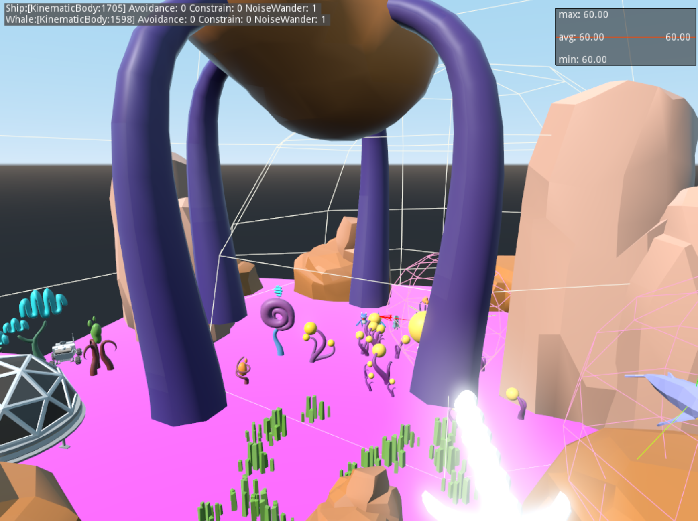

# Multi-Sensory XR Projects Workshop

## Contact me
* Email: bryan.duggan@tudublin.ie
* [My website & other ways to contact me](http://bryanduggan.org)

## Resources

- [Slides from the workshop](https://docs.google.com/presentation/d/1WZlWyuYA_7t_oRVewbF96nY2oIRIy-zb/edit?usp=sharing&ouid=102641008582291248101&rtpof=true&sd=true)
- [Godot Quick Reference](godot_ref.md)
- [Unity Quick Reference](unityref.md) 
- [Godot XR Development](https://www.youtube.com/@BastiaanOlij)
- [Recording with microphone](https://github.com/godotengine/godot-demo-projects/tree/master/audio/mic_record)

## Downloads
- [Godot 3.5.2](https://godotengine.org/download/3.x/windows/)
- [Android Studio](https://developer.android.com/studio?gclid=Cj0KCQjw0bunBhD9ARIsAAZl0E31KOyLOIt53aXWT4dkCJUXXaVqsp9lNkD3CgsC94zolXlHBNYtk5UaAkq5EALw_wcB&gclsrc=aw.ds)
- [Blender](https://www.blender.org/)
- [Oculus ADB Drivers](https://developer.oculus.com/downloads/package/oculus-adb-drivers/)
- [Blender kit](https://www.blenderkit.com/)

# XR in Godot 3 Setup:

# XR in Godot 4 Setup:

# Godot XR Tools 1

# Godot XR Tools 2 - Picking up objects

# References
- https://medicalxpress.com/news/2023-08-virtual-reality-technology-brain.html
- https://www.9news.com.au/videos/national/researchers-explore-virtual-reality-for-chronic-pain-relief/clkxtufoq00560jnw56613un4
- https://www.youtube.com/watch?v=iso9QI9Ty8Y
- https://www.theguardian.com/film/2023/aug/10/even-closing-my-eyes-is-an-intense-movement-the-vr-experience-that-simulates-a-serious-neurological-condition
- https://www.ayfie.com/ayfie-personal-assistant-students?utm_term=&utm_campaign=Performance+Max+-+EU+-+Leads&utm_source=adwords&utm_medium=ppc&hsa_acc=3428475909&hsa_cam=20421922526&hsa_grp=&hsa_ad=&hsa_src=&hsa_tgt=&hsa_kw=&hsa_mt=&hsa_net=adwords&hsa_ver=3&gclid=CjwKCAjw29ymBhAKEiwAHJbJ8iAsUzUMHbG0HKui0o2Lm2slKVUgmzpFQ-_MUb476t8IlBfL91hH4xoCrB8QAvD_BwE
- https://youtu.be/IsMl1Ehv97M
- https://quaternius.com/index.html
- https://www.youtube.com/watch?v=8kwnCxK8Vc8
- https://www.ameliavc.com/clinical-guide/?utm_campaign=EN_Clinical_Guide&utm_source=facebook&utm_medium=paidsocial&hsa_acc=1662687133951895&hsa_cam=6290956560852&hsa_grp=6290956549652&hsa_ad=6290956559052&hsa_src=fb&hsa_net=facebook&hsa_ver=3&fbclid=IwAR1SIOKviOcCxZVeSj-IBKrCd5TDpssbRlKAM1NJ8zSxFVX94MEH1f1gL-c_aem_AefG5qAY-6xgMHMxclE4PYsk3j0V-dHvc6XGKc3QWHe7ieVTyA4ALx0U5WdV56DP7qtVxodl4alKG6X63Z_QZSwT
- https://www.nature.com/articles/d42473-023-00131-7?utm_source=facebook&utm_medium=social&utm_campaign=APSR_SPOTL_ENGM_GL_PCFU_CFULF_McqU_VR23&fbclid=IwAR0FubG0AX7bsNtasmV1vcDleyuheIke_mFsW4F3XdK4u7J3JS1r9gGEAM0
- https://www.nature.com/articles/d42473-023-00131-7?utm_source=facebook&utm_medium=social&utm_campaign=APSR_SPOTL_ENGM_GL_PCFU_CFULF_McqU_VR23&fbclid=IwAR0FubG0AX7bsNtasmV1vcDleyuheIke_mFsW4F3XdK4u7J3JS1r9gGEAM0
- https://www.skillnetireland.ie/leading-vr-tech-enhances-fpt-skillnet-injection-moulding-programmes/?utm_source=facebook&utm_medium=paid_social&utm_campaign=kinetic&utm_content=image-click-ad4&fbclid=IwAR06lXuvwgx-ps1DCsplUuzAT09hb1rHpB9DqBNJKHxiBecW9tfn-Aag3kg

## Previous courses
- https://github.com/skooter500/GE2-2022-2023